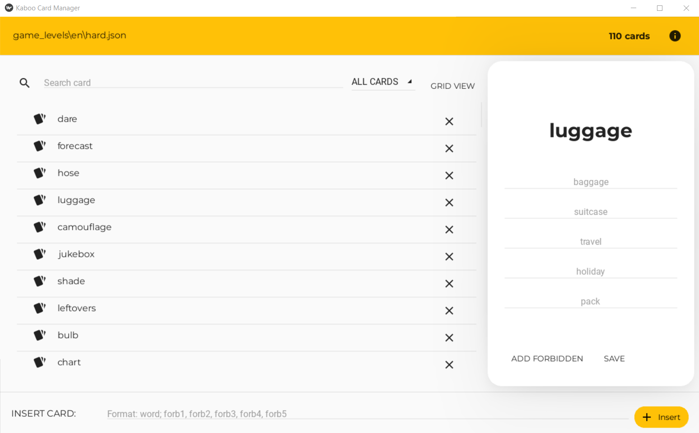

# Kaboo Card Manager

This project aims to provide a convenient tool to manipulate and enlarge 
the Kaboo game cards.
It is intended to help us and anyone who wants to increase the card base
for Kaboo and support the game.

It provides the following functionalities:
 - loading a card file from FileSystem of creating a new one; 
 - **viewing cards** in a *list* or *grid* manner;
 - **inserting**, **updating** or **deleting** cards;
 - **searching cards** by name;
 - **filtering cards** by some conditions, e.g. cards with less than 5 words for forbidden words or with duplicates.
 - It automatically saves the modifications on the file.

## Contribute
If you want to start from the files already uploaded, download the files 
contained in the `src/assets/resources/game_levels` folder of the repo 
https://github.com/stefaniavallone/kaboo.

Otherwise, you could create a new file and start from there.

### Requirements
To run this application, you need only Python and Kivy.
Install the requirements via `pip install -r requirements.txt`. 
Optionally, you could create a virtual environment.

### Sending us new cards
Once you have obtained a modified card file or a new one, to send it to us 
you can follow 2 ways:
  - make a pull request at https://github.com/stefaniavallone/kaboo;
  - send the file via email to the email address **stefaniaavallone3@gmail.com**.

We will take care of doing integrity checks on the new words. 
All help and contributions are welcome!